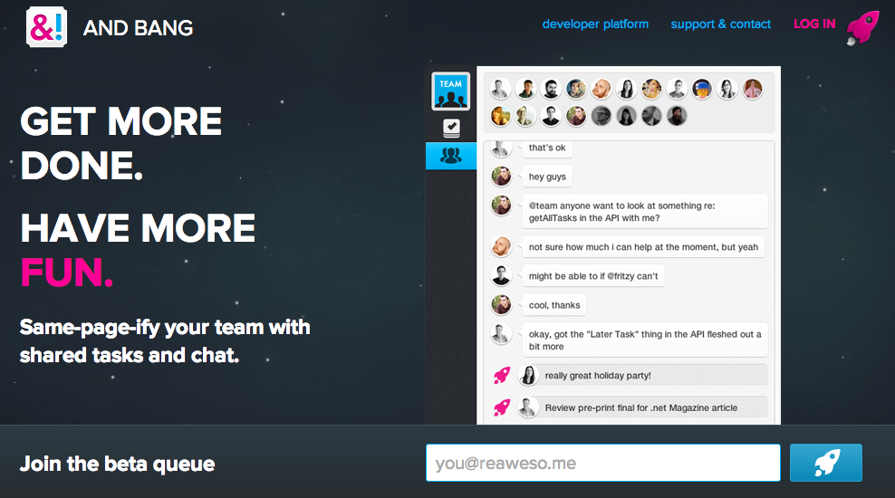

# 
## Buddycloud


Simon Tennant


---


#State of the federated social web
Notes:
"We're all here because we believe in distributed systems and the open web.


---


#feature indecision


---


#And ID should be your URL

`example.com/username`


---


#modified domain

`username.example.com`


---


#personal domain
`my-personal-domain.com`


----


#screw it!
it should be a `@username` and we'll ignore peering for the moment.


---


`2dbf1ce81180d9ed9258e3e8729ba642c8ab2a31268d31cd2c7ffe8693e3a02e`
<span data-fragment-index="1" class="fragment current-visible">Telehash-style</span>


---


##Developers have to solve some very difficult problems
<span data-fragment-index="1" class="fragment current-visible">authentication</span>
<span data-fragment-index="2" class="fragment current-visible">security</span>
<span data-fragment-index="3" class="fragment current-visible">cross-device synchronization</span>
<span data-fragment-index="4" class="fragment current-visible">offline message management</span>
<span data-fragment-index="5" class="fragment current-visible">and more</span>


----


##"We'll put up and API and call it open"


---


###"Your user's profile should include these fields"
`include <long wishlist>`
###<span data-fragment-index="1" class="fragment current-visible">what do you mean it won't run on my 256MB RaspberryPi</span>


---


###"what do you mean you don't build everything on the semantic web?"


----


###Frankly we don't have a clue what apps people will build. Each person has their own view of a solution.

###We do know that the right tools in the hands of the the right people, creative things will happen.

Notes:
- Push innovation to the edge (this has been true through history)

And so we assembled the building blocks

Federation though the back door:
Build a federated social network vs Build developers tools (that just happen to be federated)

So we started talking to developers about their problems and came up with the following list
time pressure
security and encryption concerns
lack of framework to just drop in
complexity
not sure what libraries to use
not sure how to do realtime + push

So we built a solution

Unix approach:
Small is beautiful.
Make each program do one thing well.
Build a prototype as soon as possible.
Choose portability over efficiency.

Your identifier was understandable
`username@example.com`

We used XMPP's federation layer

common language - defined in the Channels XEP

run it yourself / get hosted + migrate your data later

non-judgemental federateration

easy to extend
mix-and-match components
extend components
extend data types
extend data location


Solutiony bits.
Assumptions:
unix approach: components that specialise in one thing and interact nicely
run it yourself (or use hosted version to get going quicker)
federated or non-federated
trust your server admin
Working up the stack: XMPP solves some of these but we need applications that process the federated messages...
... buddycloud services provide a set of building blocks that can be mixed and matched and extended to build bits of the foundation of the federated social web
mix and match buddycloud components
extend components (new nodes + forking the open source code)
Exposing an API ≠ open. Open = protocol

Talk through components
channel server
media
ff
api
xmpp-ftw(-buddycloud)
pusher
search
recommender
nearby search
integrations: github / jenkins

Demo
Show posting
Show media
Show channel privacy
Hosting platform http://hosting.buddycloud.com
XMPP account
buddycloud webclient
API
XMPP-FTW


Long term goals
background: SMTP is a great federated system (what other WhatsApp or Myspace can claim to have been around for 30 years?)
Learn from SMTP and build an ecosystem of protocols, reference implementations and clients that others can benefit and reinvent communication for the next 30 years.
Chaortic leadership (visa style)

Next steps for audience:
go here right now and sign-up at hosting.buddycloud.com

## Notes Slide

This slide has some notes. Hit s.

Notes:
- Note 1
- Note 2
- Notes and notes and notes.


--


## Vertical slide


--


## Vertical slide 2


---


## **JS** is cool

```javascript
// comment
var x = 100,
    y = ['a', 100, {}],
    z = {
        x: 'z'
    };
// IIFE
(function ($, window, undefined) {
    // What am I doing?
    var _test = function () {};
    return {
        test: _test
    };
})(jQuery, window)
```


---


## Slide Heading
### Sub Heading

Some text. *Italic.* **Bold.**


---


<h1 class="big">Big **Title** Slide</h1>


---


## Bulleted Fragment List

<ul>
    <li class="fragment">This is a <span>thing</span></li>
    <li class="fragment">This is <span>thing</span> thing</li>
    <li class="fragment">Thing <span>3</span></li>
</ul>


---


## Simultaneous Fragments


<span data-fragment-index="1" class="fragment current-visible">One</span>
<span data-fragment-index="2" class="fragment current-visible">at</span>
<span data-fragment-index="3" class="fragment current-visible">a</span>
<span data-fragment-index="4" class="fragment current-visible">time</span>


---


## Slide with an image




---


## More slides

> This is a blockqoute!  
> Line 2  
> <small>Luke?</small>


---


<!-- .slide: data-background="#000" data-state="hide-all-controls"  -->
# The End <span class="fragment">?</span>


---


<!-- .slide: data-background="#000" -->
# &nbsp;


