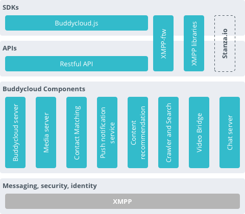
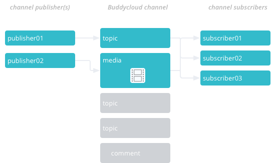
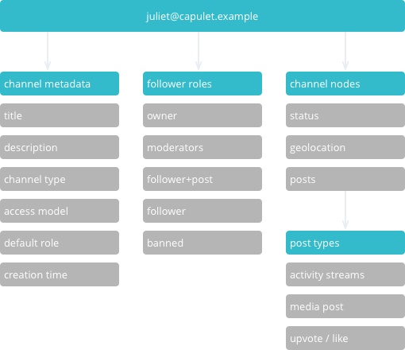

---


#State of the federated social web
Notes:
"We're all here because we believe in distributed systems and the open web.


---


##Developers have to solve some very difficult problems

<ul>
    <li class="fragment">authentication</li>
    <li class="fragment">security</li>
    <li class="fragment">cross-device synchronization</li>
    <li class="fragment">offline message management</li>
    <li class="fragment">and more</li>
</ul>


---


##feature indecision


---


##identity indecision
<span data-fragment-index="1" class="fragment current-visible">`example.com/username`</span>
<span data-fragment-index="2" class="fragment current-visible">`username.example.com`</span>
<span data-fragment-index="3" class="fragment current-visible">`my-personal-domain.com`</span>
<span data-fragment-index="4" class="fragment current-visible">`@username` and we'll ignore peering for the moment</span>
<span data-fragment-index="5" class="fragment current-visible">2dbf1ce81180d9ed9258e3e8729ba642c8ab2a31268d31cd2c7ffe8693e3a02e</span>


---


### "We'll put up and API and call it open"


---


###"Your user's profile should include these fields"
`include <long wishlist>`
* <span class="fragment">"You insensitive clod! What do you mean it won't run on my RaspberryPi?".</span>  <span class="fragment">256MB</span>


---


###"what do you mean you don't build everything on the semantic web?"


---


###Frankly we don't have a clue what apps people will build. Each person has their own view of a solution.


---


##push innovation to the edge#

* right tools 
* in the right hands
* creative things will happen.
Notes:
- Push innovation to the edge (this has been true through history)


---


##We need building blocks


---


##we have been doing it all wrong
* Build a federated social network
* Build developers tools (that just happen to be federated)


---


###We came up with a plan
<ul>
    <li class="fragment">time pressure</li>
    <li class="fragment">security and encryption concerns</li>
    <li class="fragment">lack of a framework to just drop in</li>
    <li class="fragment">complexity</li>
    <li class="fragment">not sure what libraries to use</li>
    <li class="fragment">not sure about how to do realtime or push</li>
</ul>


---


#So we built a solution


---


##Unix approach
- Small is beautiful.
- Make each program do one thing well.
- Build a prototype as soon as possible.
- Choose portability over efficiency.


---


Your identifier is understandable

`username@example.com`


---


##Used XMPP's federation layer


---


Defined a [common language](https://github.com/buddycloud/buddycloud-xep)/"XEP"


---


##non-judgemental federateration

run it yourself / get hosted + migrate your data later


---


##easy to extend
* fork the open source code
* mix-and-match components
* extend components
* extend data types
* extend data location


---


##Assumptions
* run it yourself (or use hosted)
* trust your server admin

Notes:
- Working up the stack: XMPP solves some of these but we need applications that process the federated messages...


---


Buddycloud is a set of federated building blocks that can be mixed and matched and extended


---


##Components
* server process
* interconnect using TCP
* interconnect with local and remote servers


---


###Buddycloud components
* channel server
* media server
* friend finder
* HTTP api server
* XMPP-ftw(-buddycloud)
* push notifications
* content and channel search
* recommender
* nearby search


---





---


###...and integrations
* github
* jenkins


---





---





---


###Demo
* Show posting
* Show media


---


###Long term goals
* Chaortic leadership to create the open web
* 30 year goal


---


###Next steps
* hosting.buddycloud.com
* github.com/buddycloud
* @buddycloud


---


---


## Notes Slide

This slide has some notes. Hit s.

Notes:
- Note 1
- Note 2
- Notes and notes and notes.


---


## Vertical slide


--


## Vertical slide 2


---


## **JS** is cool

```javascript
// comment
var x = 100,
    y = ['a', 100, {}],
    z = {
        x: 'z'
    };
// IIFE
(function ($, window, undefined) {
    // What am I doing?
    var _test = function () {};
    return {
        test: _test
    };
})(jQuery, window)
```


---


## Slide Heading
### Sub Heading

Some text. *Italic.* **Bold.**


---


<h1 class="big">Big **Title** Slide</h1>


---


## Bulleted Fragment List

<ul>
    <li class="fragment">This is a <span>thing</span></li>
    <li class="fragment">This is <span>thing</span> thing</li>
    <li class="fragment">Thing <span>3</span></li>
</ul>


---


## Simultaneous Fragments


<span data-fragment-index="1" class="fragment current-visible">One</span>
<span data-fragment-index="2" class="fragment current-visible">at</span>
<span data-fragment-index="3" class="fragment current-visible">a</span>
<span data-fragment-index="4" class="fragment current-visible">time</span>


---


## Slide with an image


---


## More slides

> This is a blockqoute!  
> Line 2  
> <small>Luke?</small>


---


<!-- .slide: data-background="#000" data-state="hide-all-controls"  -->
# The End <span class="fragment">?</span>


---


<!-- .slide: data-background="#000" -->
# &nbsp;


